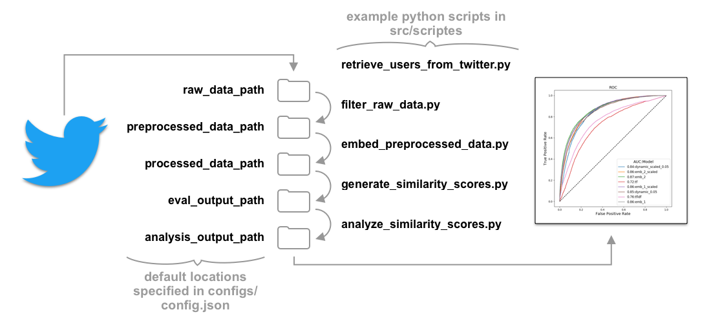

# *Did I write this?!*  AI to Detect Fraudulent Tweets
Fraudulent posts on social media are embarrassing to individuals and expensive to brands.  Language embedding models offer a means to characterize typical activity for a user and can be applied in a simple binary discriminator to screen incoming content.

This repository provides a demonstration of the use of language embedding (via [Universal Sentence Encoder](https://tfhub.dev/google/universal-sentence-encoder/2)) to classify new Twitter posts as in or out-of-character for a particular user.  In a production system (implemented on the platform side), a user could be presented with secondary authentication to validate activity for the occasional false positive.

Slides describing this project can be found here:  https://bit.ly/didIWriteThis

## Setup

Clone this repo with `git clone https://github.com/JoshuaGRubin/AI-Tweet-Validator.git <project_path>` on your command line.

*Optional*: while data from 13 Twitter users in included in the `data/raw` directory, if you'd like to be able to retrieve your own (e.g. more/other users, more recent tweets), you'll need to set up a Twitter developer account and app.  To do so, please visit https://developer.twitter.com, create an app, and have it approved. Once this is complete, you'll have access to API credentials. 

### Setup with Docker – *portable and stable*
**The recommended way to run this project is by installing Docker and building and running an image**.  This process manages libraries, the python runtime environment, and dependences; it also manages environment variables nicely.  This maximizes stability and portability.

- First, visit https://www.docker.com to install the Docker platform (e.g. Docker Desktop) on your machine.

- If you've created a Twitter developer account and you'd like to download new content, uncomment the specified four rows in `build\Dockerfile` and paste in your credentials.

- To build and run your container, run the following in your command shell.

```
> cd <project_path>
> ./build_docker
> ./run_docker
```

- At this point, you should be in a Docker shell at the root level of the project directory, mounted to `/app/` and shared with your host OS.  You should be able to `cd src/scripts` and `python <script_name>` to run any of the example scripts.  You also have the library, 'tweetvalidator' (from src/tweetvalidator) available in you `PYTHONPATH`, so you can include it in any of your own scripts.

### Setup with Anaconda – *lightweight*

While this setup has a few more steps and possibly plateform-dependent pitfalls, there's less to download and store on disk.

- Install a Python 3.x Anaconda environment from https://www.anaconda.com/distribution.
- Run the following to create a new conda/Python environment:

```
> conda create --name <environment_name>
> conda activate <environment_name>
> conda install pip

# Install project dependencies - includes `tweetvalidator`, the core module provided by this project.
> cd <project_path>/build
> pip install -r requirements.txt
```


- If you're going to be using the Twitter API, edit build/insightTwitterCreds.bat and add your credentials.
Run:
```
> source twitter_creds.txt
```

- Please keep in mind that you'll have to `conda activate <environment_name>` every time a shell launches.  If you plan on spending a lot of time working with this package, consider adding the following lines the end of your `~/.bash_profile`:

```
> conda activate <environment_name>
> source <project_path>/twitter_creds.txt
```

## Running the Project

The project code resides in <project_path>/src and is divided into two parts:

### 1. A Python package called `tweetvalidator`,
which contains reusable core components.  In either of the two installation scenarios described above, this should be available to `import`.
- `tweetvalidator.data_processing` contains tools for downloading, filtering, and embedding Twitter data.
- `tweetvalidator.models` contains the embedding-based models ('clustered_cos_sim_model'), which can be used for mean embedding and a variety of multi-cluster variations, as well as a term-frequency model (TF and TDIDF) as a statistical baseline.  Each of these models has a `characterize` method in which it's initialized and a similarity_score method for comparing a new tweet against the model's characterization.

### 2. A directory, `scripts`,
which take advantage of `tweetvalidator`, and can be run out-of-the-box to produce the results presented in the slides provided above.  Furthermore, the data directories come pre-populated with tweets from sixteen users.  **These scripts are the best starting place to running project** and provide examples for how to use the functionality in `tweetvalidator` if one wanted to build on this work.

These scripts get their configuration details (data directories and settings) from `<project_path>/configs/config.json`. The project flow, which moves data from directory-to-directory at each step is depicted in the following diagram:



The variables below are specified in `config.json`.  Run these scripts (e.g. `>python filter_raw_data.py`) in this order to reproduce 

- **retrieve_users_from_twitter.py** (requires the optional Twitter configuration/credentials described above).  Downloads `max_tweets_per_user` tweets for the list of users in `twitter_users`.  It writes to `raw_data_path`.
- **filter_raw_data.py** Reads tweets from `raw_data_path`, removes strings matching the regular expressions in `regexp_tweet_filters` (e.g. hashtags, user-references, URLs), and writes tweets with at least `min_tweet_characters` to `preprocessed_data_path`.
- **embed_preprocessed_data.py** reads tweets from `preprocessed_data_path`, generates an embedding using Universal Sentence Encoder, and writes the tweets with associated embeddings to `processed_data_path`.  The embedding module has a slow setup time (15s on my laptop), but subsequent invocations after initialization won't incur this penalty and the actual embedding is on the ms scale per call.  The first call will also need to download the ≈1GB TensorFlow Hub module - but this should remain cached.  Finally, I've encountered an exception with TF Hub caching of the module... see the Troubleshooting section.
- **generate_similarity_scores.py** reads data from `processed_data_path`; splits it into user-characterization and test sets; initializes a variety of models, both embedding-based and term-frequency-based; and uses those models to generate cosine similarity scores for the test data.  These results are written to `eval_output_path`.  *Ideally*, the selection of models and variations would be configurable in `config.json`, but that's a future to-do, and in the meantime, `generate_similarity_scores.py` can be copied and modified (it is an example, after all!).
- **analyze_similarity_sores.py** reads similarity scores from `eval_output_path` and generates ROC/AUC graphs and data tables providing "sensitivity at false-positive-rate x" statements.  Results are written to `analysis_output_path`.

## Test
To run a set of nontrivial unit-tests on the core tweetvalidator package, navigate to the tests directory and run pytest:

    > cd <project_path>/tests
    > pytest

## Troubleshooting

There's occasionally a problem with TensorFlow Hub that causes the following error:

>Encoder tf-hub error:
RuntimeError: Missing implementation that supports: loader(*('/var/folders/0w/pn889r517f9220q1vl66k7_h0000gn/T/tfhub_modules/1fb57c3ffe1a38479233ee9853ddd7a8ac8a8c47',), **{})

This seems to have something to do with the way Universal Sentence Encoder is cached.  Sometimes it's deleted, but TF Hub still thinks it's present.  If you encounter this, simply delete the directory mentioned in the error and rerun.

